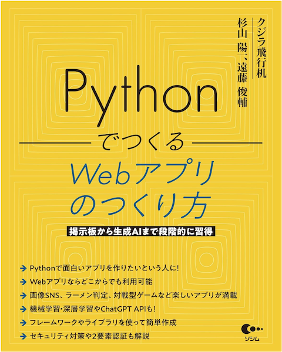

# 書籍『Webアプリの作り方』のサンプルプログラム

- Pythonで面白いアプリを作りたいという人に
- Webアプリならどこからでも利用可能
- 画像SNS、ラーメン判定、対戦型ゲームなど楽しいアプリが満載
- 機械学習・深層学習やChatGPT APIも!
- フレームワークやライブラリを使って簡単作成
- セキュリティ対策や2要素認証も解説

| 書籍情報 |                  |
| ------------ | -------------- |
| 出版社 | [ソシム](https://www.socym.co.jp/) (2025年) |
| 著者 | クジラ飛行机 / 杉山陽一 / 遠藤俊輔 |
| ISBN-10 | 4802614969        |
| ISBN-13 | 978-4802614962 |

- [Amazonで購入](https://amzn.to/3VCJs3N)

## 目次

- 第1章 Webアプリとは?どんなアプリが作れる？
- 第2章 Webアプリの基
- 第3章 Webフレームワークとデータベース
- 第4章 実践Webアプリを作ってみよう
- 第5章 機械学習を使ったWebアプリを作ろう
- 第6章 生成AI・大規模言語モデルを活用したアプリ
- 第7章 アプリのデプロイとチェックリスト
